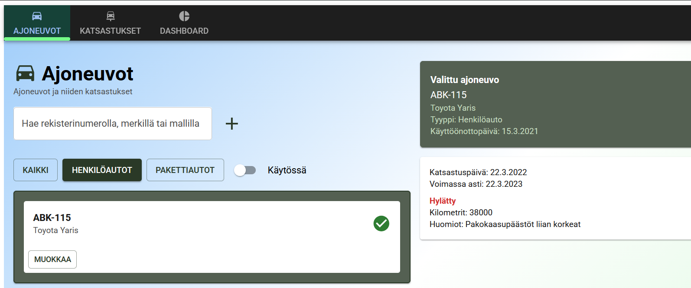
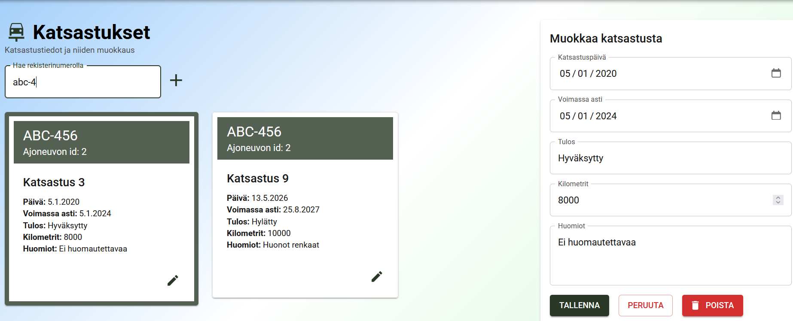
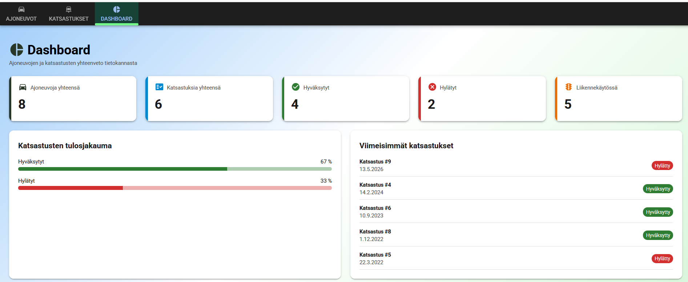

# Front End Development - Application

This project was created as a school assignment. 

The frontend was built with React and Material UI (MUI), using Vite as the development and build tool. The application also includes a small Node.js and Express backend with an SQLite database for managing vehicles and their inspections.

## Pictures

